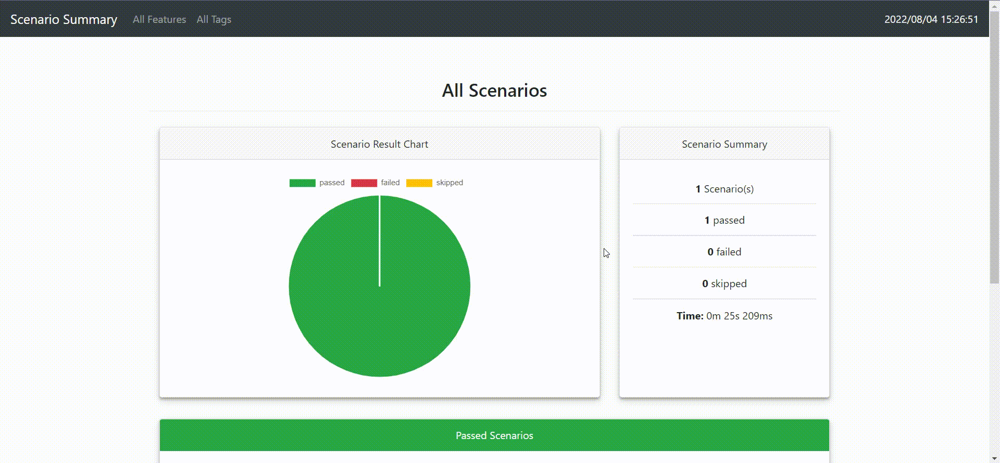
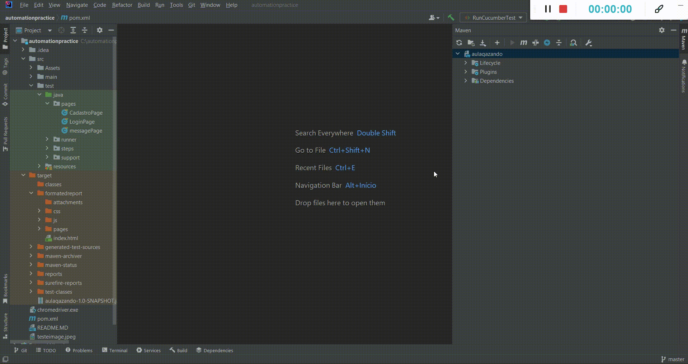

# Praticando Testes Automatizados

### Ferramentas Utilizadas:

 - Java: https://www.java.com/pt-BR/download/ie_manual.jsp?locale=pt_BR
 - Intellij: https://www.jetbrains.com/idea/
 - Google: https://www.google.com/intl/pt-BR/chrome/
 - WebDriver: https://chromedriver.chromium.org/downloads

### O que esse projeto faz:

- [X] Acesso ao Site: http://automationpractice.com
- [X] Cadastra um novo usuário
- [X] Se Certifica do cadastro 
- [X] Envia uma mensagem com Foto para o site  

## Relatório de Testes:

    

##

## Para o projeto rodar basta baixá-lo, caso queira gerar/executar o relatório:

    

